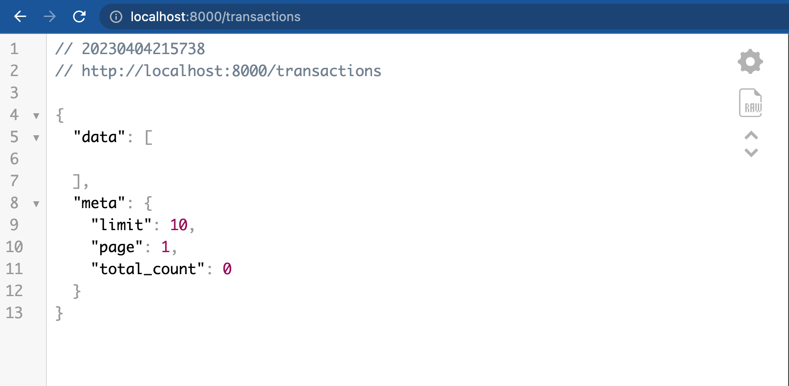

### MESSAGE QUEUE PROJECT

### How to run this app

### 1. Locally

- Pull the repo
- insert the .env file, see `.sample_env`
- Run `go mod download`
- start your rabbitmq server locally or using docker

```text
docker run -d --hostname rabbitmq --name rabbitmq -p 5672:5672 rabbitmq:3
```

- start your `msql` server
- Run the app
  
```text
go run main.go
```

or using the make file 

```text
make run
```

### 2. Using Docker-Compose

- start docker
- Run the app by using the make file
  
```text
make compose
```


